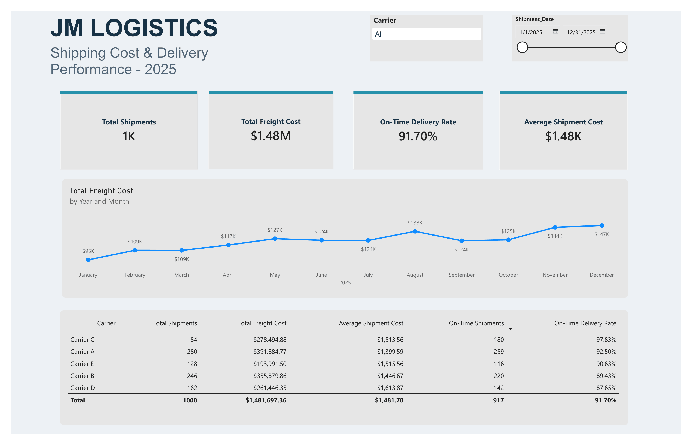

# JM Logistics — Shipping Cost & Delivery Performance

A MySQL and Power BI portfolio project analyzing shipping costs and carrier delivery performance using 1,000 fictional shipment records from 2025.

## Dashboard



## Business Questions

- How many shipments did we handle?
- How much did we spend on shipping?
- What was the average cost per shipment?
- What percentage of shipments arrived on time?
- How did costs and delivery reliability vary by carrier?
- How did shipping expenditure change each month?

## Tools

- **MySQL:** SQL analysis and independent validation of report figures.
- **Power Query:** Data types, text trimming, and checks for missing values and errors.
- **DAX:** Reusable measures for shipment counts, freight costs, and delivery performance.
- **Power BI:** Interactive report with KPI cards, a monthly chart, a carrier table, and date and carrier slicers.

## Dataset

The dataset contains 1,000 fictional completed shipments across five carriers from January–December 2025.

Each row represents one shipment.

| Column | Description |
|---|---|
| Shipment_ID | Unique shipment identifier |
| Shipment_Date | Dispatch date |
| Carrier | Transport company |
| Transport_Mode | Truck or Rail |
| Distance_Miles | Shipment distance in miles |
| Freight_Cost | Shipping charge in USD |
| Delivery_Status | On Time or Late |

## Key Results

| Metric | Result |
|---|---:|
| Total shipments | 1,000 |
| Total freight cost | $1,481,697.36 |
| Average shipment cost | $1,481.70 |
| On-time shipments | 917 |
| On-time delivery rate | 91.70% |

## Findings

- **Carrier C** had the highest on-time delivery rate at **97.83%**.
- **Carrier D** had the lowest on-time rate at **87.65%** and the highest average shipment cost at **$1,613.87**.
- **Carrier A** handled the most shipments (**280**) and had the lowest average shipment cost (**$1,399.59**).
- **December** had the highest freight expenditure at **$146,533.19**.
- **November and December** each recorded **95 shipments**, the highest monthly volume.

Higher average cost alone does not prove poor efficiency. Distance and transport mode should be considered before making carrier decisions.

## DAX Measures

Each definition below is a separate measure in the Shipments table.

```dax
Total Shipments = COUNTROWS(Shipments)

Total Freight Cost = SUM(Shipments[Freight_Cost])

Average Shipment Cost =
DIVIDE([Total Freight Cost], [Total Shipments])

On-Time Shipments =
CALCULATE(
    [Total Shipments],
    Shipments[Delivery_Status] = "On Time"
)

On-Time Delivery Rate =
DIVIDE([On-Time Shipments], [Total Shipments])
